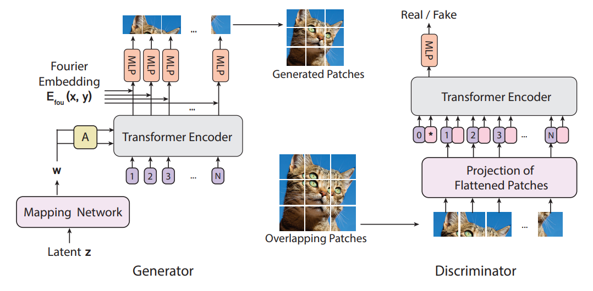

# ViTGAN: Training GANs with Vision Transformers
A PyTorch implementation of ViTGAN based on paper [ViTGAN: Training GANs with Vision Transformers](https://arxiv.org/abs/2107.04589v1).




---
# Reference
```
Kwonjoon Lee, Huiwen Chang, Lu Jiang, Han Zhang, Zhuowen Tu, Ce Liu. ViTGAN: Training GANs with Vision Transformers. arXiv:2107.04589v1, 2021.
```

# Author
**Hong-Jia Chen**